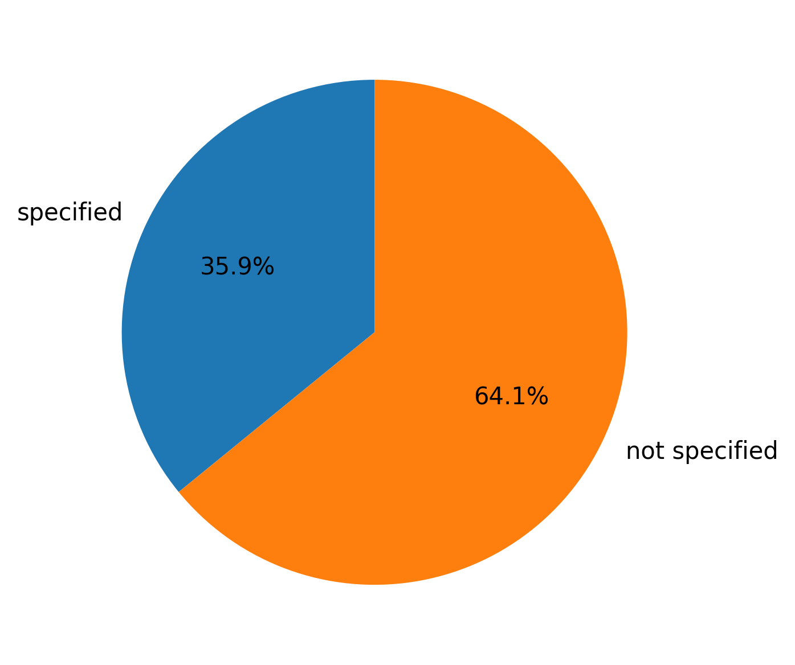
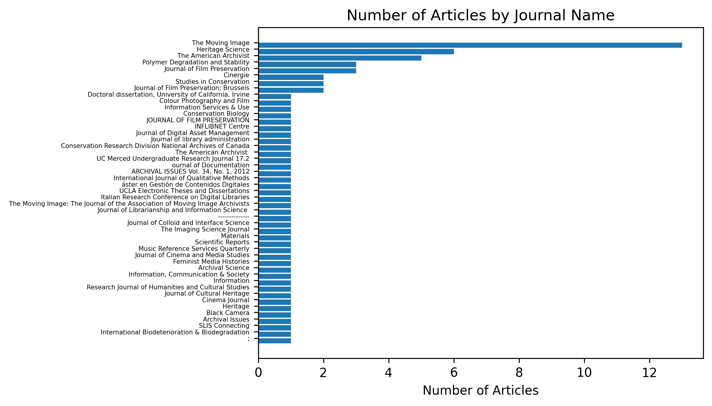
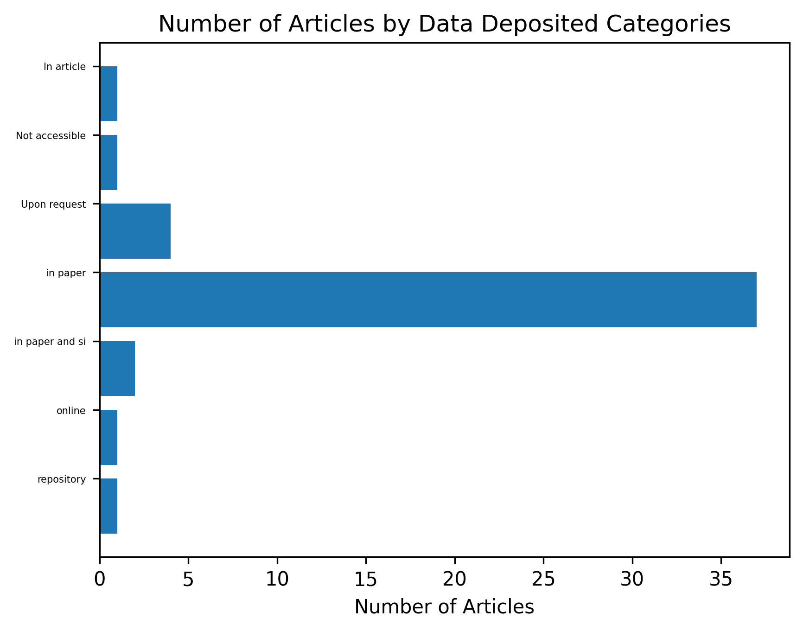

# Film Archival Metadata
This project contains a collection of journal articles related to the field of film and media archivial techiniques and practices. Those articles have been coded and uploaded to the [Coding_Template.xlsx](./Coding_Template.xlsx) file.

# Organization of the Coding_Template.xlsx
The columns of the xlsx file are located below and they indicate the following:

**DOI/URL** - The DOI of the article if one exists, or a URL if none is found 

**Title	Author** - The Author(s) of the article

**Journal Name** - The Journal of record the article was obtained from or located in

**Publication Year** - The year of publication of the article

**Issue/Focus** - The focus of the paper/article

**Data Collected** - If any data was collected what type of data was collected; for e.g. surverys, interviews, lab tests, ect.

**Data Deposited** - Where any of the data was deposited if publicly available

**DOI/URL of Data Deposit** - The location of that data via a URL or a DOI if available

**What data repository** - The format the data was held in or location

**DOI of Cited Data Paper** - If the data repository was located then its DOI would be located here

**Funding Source** - The source of funding for the article if disclosed and published

# Credits
This collaborative metadata project was completed by Jane Montañez, Sofia Milat, and Tony Hernandez for a UCLA's Information Studies Department, Data Managment course.

# Data Visualizations
A collection of our metadata materials as composed into data visualizations via python are collected and annotated below:

